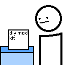

# Boring Template

This is my personal template, it's specially made for my own needs, and therefore, it's not suited to other human beings (however, you can still use it, if you don't mind the personal tweaks). This is a fork of the [Fabric Example Mod](https://github.com/FabricMC/fabric-example-mod), which is more generic, therefore, a better template for regular human beings. This template also borrows [Blueprint's](https://github.com/FabLabsMC/Blueprint) GitHub Actions/Packages integration, most of the integration is directly (or indirectly) from there.

## Usage

You should be able to setup BoringTemplates for your own usage by the same way you setup the Fabric Example Mod template. The mysterious `crid` should be replaced with a real mod id and `build.gradle` must be changed in order to reflect the mod's actual repository.

<!--
## Download

This mod is available for download on the following services:

- [CurseForge (recommended)](https://www.curseforge.com/minecraft/mc-mods/)
- [GitHub Releases (alternative)](https://github.com/)
- [GitHub Packages (indev releases, **use at your own risk**)](https://github.com/)
-->

## License

This template, like the original template which this is based on, is available under the CC0 license. You are free to do whatever you want with this template. A copy of the MIT license is contained in this repository as a personal utility and it isn't applied on this template.

<!-- The commented text is meant for the projects based on this template, for the license of the template, see above.

This mod is licensed under the MIT license. You can freely include the mod on any modpack with no permission.
-->